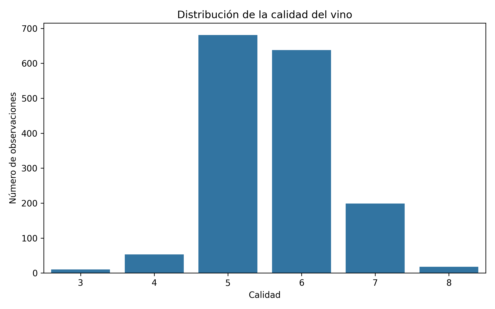
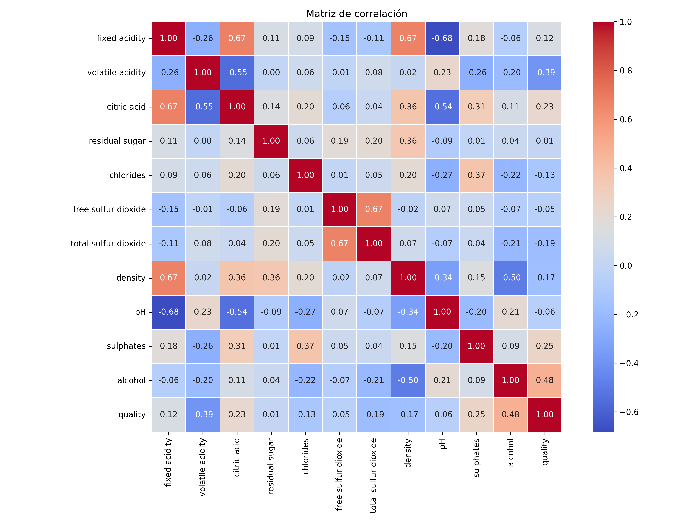
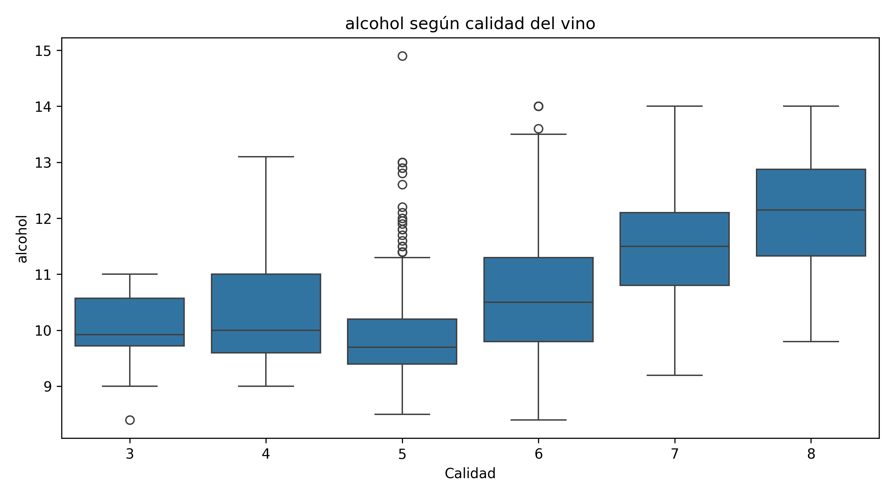
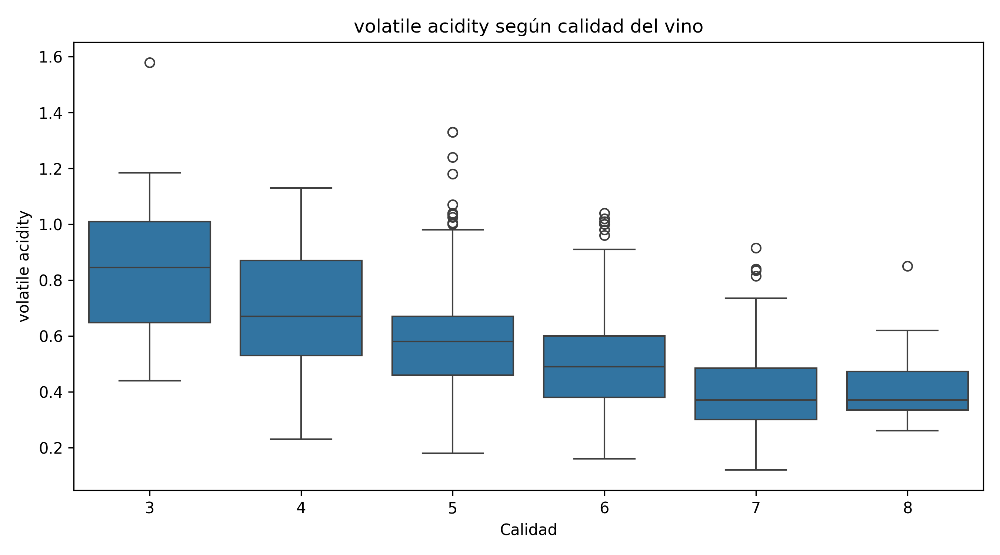
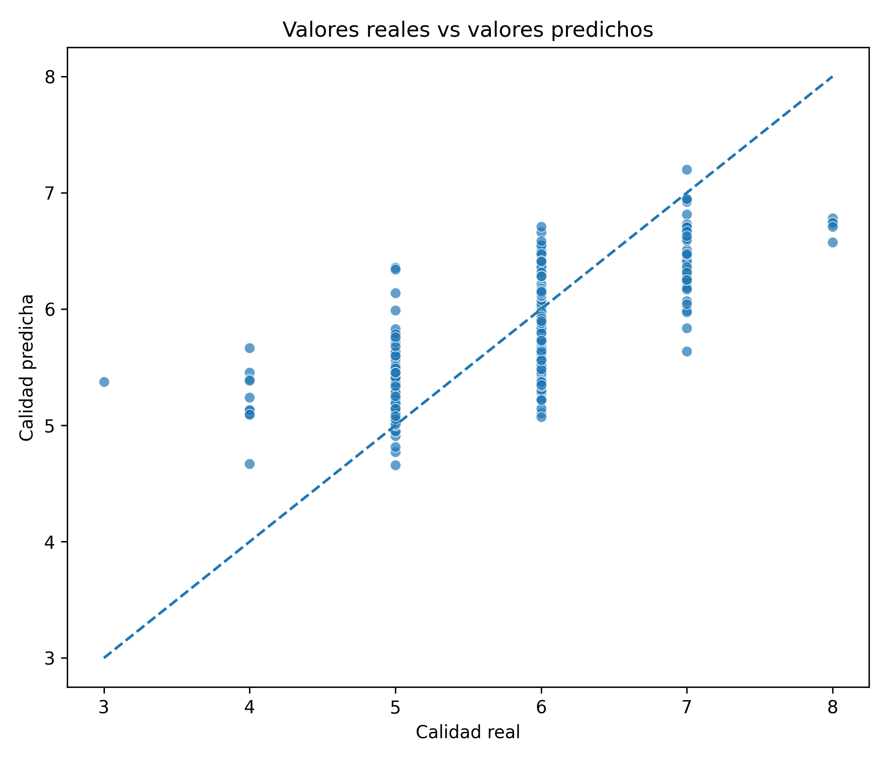
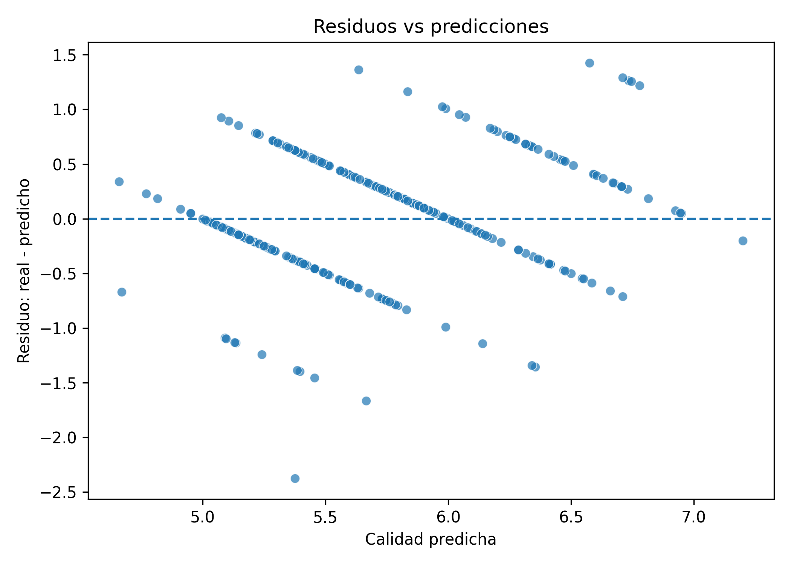
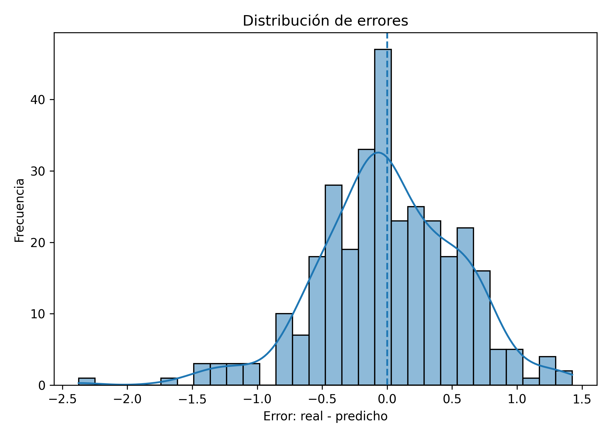
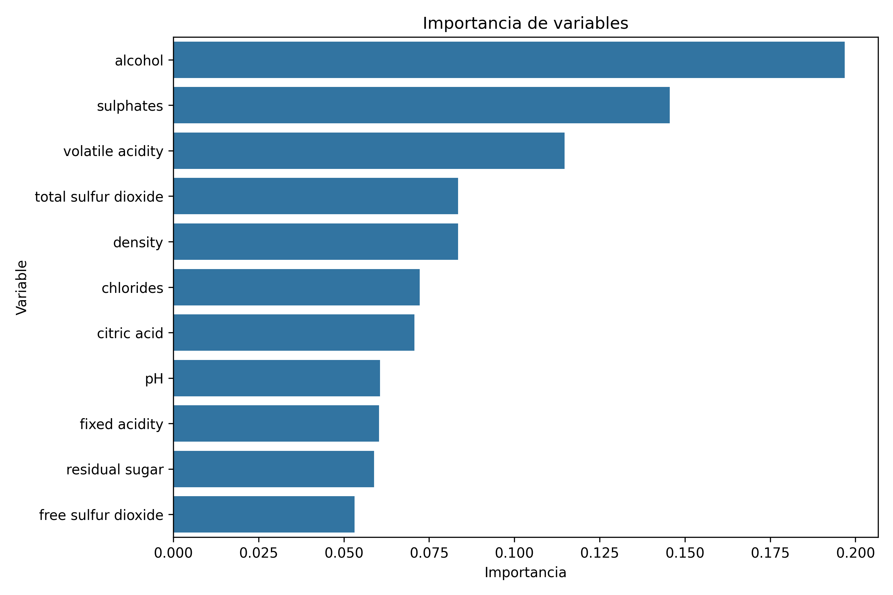

# Proyecto de Statistical Learning: Predicción de Calidad del Vino

Autor: Mateo Díaz 

Este repositorio contiene un proyecto práctico de Machine Learning aplicado al dataset **UCI Wine Quality**. El objetivo es construir, comparar y evaluar modelos capaces de predecir la calidad del vino a partir de variables fisicoquímicas como `pH`, `sulphates`, `alcohol` y `volatile acidity`.

El proyecto sigue una arquitectura limpia para separar datos, notebooks, código fuente, resultados, modelos entrenados y figuras del informe.

---

## 1. Objetivo del proyecto

El objetivo principal es desarrollar un pipeline reproducible de Statistical Learning que incluya:

1. Análisis exploratorio de datos, también conocido como EDA.
2. Decisiones de preprocesamiento.
3. Diseño de selección de modelos.
4. Comparación de modelos base y modelos tuneados.
5. Evaluación final en un conjunto de test no usado durante entrenamiento.
6. Interpretación de resultados.
7. Ejemplos de predicción.

Para este proyecto, la variable objetivo es:

```text
quality
```

Inicialmente se modela como un problema de **regresión**, ya que `quality` es una variable numérica ordinal. Esta decisión permite estimar una puntuación continua de calidad, aunque en el informe se discuten sus consecuencias, como el hecho de que las calidades extremas suelen tener menos observaciones.

---

## 2. Dataset

Dataset utilizado:

**UCI Wine Quality Dataset**

Fuente oficial:

```text
https://archive.ics.uci.edu/ml/datasets/Wine+Quality
```

En este proyecto se utiliza el archivo de vino rojo:

```text
data/raw/winequality-red.csv
```

El dataset contiene variables fisicoquímicas del vino, entre ellas:

- fixed acidity
- volatile acidity
- citric acid
- residual sugar
- chlorides
- free sulfur dioxide
- total sulfur dioxide
- density
- pH
- sulphates
- alcohol
- quality

---

## 3. Arquitectura del repositorio

```text
wine-quality-ml/
│
├── README.md
├── requirements.txt
├── .gitignore
├── config.yaml
│
├── data/
│   ├── raw/
│   │   └── winequality-red.csv
│   ├── processed/
│   └── predictions/
│
├── notebooks/
│   └── 01_eda.ipynb
│
├── src/
│   ├── __init__.py
│   ├── data.py
│   ├── features.py
│   ├── models.py
│   ├── train.py
│   ├── tune.py
│   ├── evaluate.py
│   ├── predict.py
│   └── eda.py
│
├── reports/
│   ├── figures/
│   ├── eda_notes.md
│   └── evaluation_notes.md
│
├── results/
│   ├── model_comparison.csv
│   ├── tuned_model_comparison.csv
│   ├── final_test_metrics.csv
│   ├── tuned_final_test_metrics.csv
│   ├── evaluation_metrics.csv
│   ├── evaluation_predictions.csv
│   ├── final_predictions.csv
│   ├── eda_summary_statistics.csv
│   └── target_distribution.csv
│
└── models/
    ├── best_model.pkl
    └── best_tuned_model.pkl
```

### Descripción de carpetas principales

| Carpeta | Descripción |
|---|---|
| `data/raw/` | Datos originales descargados de UCI. |
| `data/processed/` | Datos procesados o transformados. |
| `notebooks/` | Notebooks de exploración. |
| `src/` | Código fuente reutilizable del proyecto. |
| `models/` | Modelos entrenados guardados en formato `.pkl`. |
| `results/` | Métricas, comparaciones y tablas de predicción. |
| `reports/figures/` | Figuras generadas para el informe. |

---

## 4. Requisitos

Se recomienda usar **Python 3.11**.

Python 3.14 no se recomienda para este proyecto porque algunas librerías de Machine Learning pueden no tener todavía compatibilidad estable.

Librerías principales:

- numpy
- pandas
- matplotlib
- seaborn
- scikit-learn
- joblib
- pyyaml
- jupyter

---

## 5. Instalación y preparación del entorno

Desde la raíz del proyecto:

```bash
py -3.11 -m venv .venv
```

Activar el entorno virtual en Windows PowerShell:

```bash
.\.venv\Scripts\activate
```

Actualizar `pip`:

```bash
python -m pip install --upgrade pip
```

Instalar dependencias:

```bash
pip install -r requirements.txt
```

Si todavía no existe `requirements.txt`, instalar manualmente:

```bash
pip install numpy pandas matplotlib seaborn scikit-learn joblib pyyaml jupyter
pip freeze > requirements.txt
```

---

## 6. Configuración del proyecto

El archivo `config.yaml` centraliza rutas y parámetros importantes:

```yaml
project:
  name: wine-quality-ml
  random_state: 42

data:
  raw_path: data/raw/winequality-red.csv
  processed_path: data/processed/wine_quality_processed.csv
  predictions_path: results/final_predictions.csv

target:
  column: quality
  problem_type: regression

split:
  test_size: 0.2
  cv_folds: 5

models:
  save_path: models/best_model.pkl
```

Esto permite mantener el proyecto más ordenado y reproducible.

---

## 7. Flujo de ejecución

### 7.1 Verificar carga de datos

```bash
python src/data.py
```

Este script carga el archivo original, muestra información básica del dataset y guarda una versión procesada inicial.

---

### 7.2 Ejecutar EDA

```bash
python src/eda.py
```

Este script genera:

```text
results/eda_summary_statistics.csv
results/target_distribution.csv
reports/figures/target_distribution.png
reports/figures/correlation_matrix.png
reports/figures/hist_pH.png
reports/figures/hist_sulphates.png
reports/figures/hist_alcohol.png
reports/figures/hist_volatile_acidity.png
reports/figures/box_pH_vs_quality.png
reports/figures/box_sulphates_vs_quality.png
reports/figures/box_alcohol_vs_quality.png
reports/figures/box_volatile_acidity_vs_quality.png
```

#### Distribución de la variable objetivo



#### Matriz de correlación



#### Alcohol vs calidad



#### Volatile acidity vs calidad



---

### 7.3 Entrenar modelos base

```bash
python src/train.py
```

Este script:

1. Carga los datos.
2. Separa `X` e `y`.
3. Divide en train/test.
4. Crea pipelines con preprocessing y modelo.
5. Compara modelos con k-fold cross-validation.
6. Guarda el mejor modelo base.

Modelos comparados:

- Ridge Regression
- Lasso Regression
- Elastic Net
- Decision Tree Regressor
- Random Forest Regressor
- Support Vector Regression
- Neural Network con `MLPRegressor`

Archivos generados:

```text
results/model_comparison.csv
results/final_test_metrics.csv
models/best_model.pkl
```

---

### 7.4 Tuneo de hiperparámetros

```bash
python src/tune.py
```

Este script usa `GridSearchCV` para ajustar hiperparámetros de cada modelo.

Archivos generados:

```text
results/tuned_model_comparison.csv
results/tuned_final_test_metrics.csv
models/best_tuned_model.pkl
```

El conjunto de test final permanece intacto durante la selección de modelos y solo se utiliza al final.

---

### 7.5 Evaluación final

```bash
python src/evaluate.py
```

Este script carga el mejor modelo tuneado y evalúa su rendimiento sobre el test set final.

Archivos generados:

```text
results/evaluation_metrics.csv
results/evaluation_predictions.csv
results/feature_importance.csv
reports/figures/actual_vs_predicted.png
reports/figures/residuals_vs_predictions.png
reports/figures/error_distribution.png
reports/figures/feature_importance.png
```

#### Valores reales vs predichos



#### Residuos vs predicciones



#### Distribución de errores



#### Importancia de variables



> Nota: la importancia de variables solo se genera si el mejor modelo tiene `feature_importances_` o `coef_`. Si el mejor modelo es SVR o MLPRegressor, puede no existir una importancia directa.

---

### 7.6 Generar ejemplos de predicción

```bash
python src/predict.py
```

Este script carga el mejor modelo tuneado y genera una tabla de predicciones de ejemplo.

Archivo generado:

```text
results/final_predictions.csv
```

Incluye:

- variables fisicoquímicas del vino
- calidad real
- calidad predicha
- error absoluto

---

## 8. Modelos evaluados

| Modelo | Descripción |
|---|---|
| Ridge | Regresión lineal regularizada con penalización L2. |
| Lasso | Regresión lineal regularizada con penalización L1; puede hacer selección de variables. |
| Elastic Net | Combina L1 y L2; puede ser más estable que Lasso con predictores correlacionados. |
| Decision Tree | Modelo no lineal interpretable, pero propenso a overfitting. |
| Random Forest | Ensamble de árboles que reduce varianza mediante promediado. |
| SVR | Modelo de margen para regresión, sensible a `C`, `epsilon` y kernel. |
| Neural Network | Red neuronal pequeña usada como baseline flexible no lineal. |

---

## 9. Métricas utilizadas

Como el problema se trata inicialmente como regresión, se usan:

| Métrica | Interpretación |
|---|---|
| RMSE | Penaliza más los errores grandes. Menor es mejor. |
| MAE | Error absoluto promedio en puntos de calidad. Menor es mejor. |
| R² | Proporción de variabilidad explicada por el modelo. Mayor es mejor. |

---

## 10. Prevención de data leakage

El proyecto evita filtración de información mediante las siguientes decisiones:

1. El conjunto de test se separa antes de la selección final.
2. El escalamiento se incluye dentro de `Pipeline`.
3. La validación cruzada se aplica sobre el conjunto de entrenamiento.
4. El test set solo se usa para la evaluación final.
5. El preprocesamiento se aprende dentro de cada fold durante cross-validation.

---

## 11. Interpretación esperada

A partir del EDA y los modelos interpretables, se espera observar que:

- `alcohol` suele estar positivamente asociado con mayor calidad.
- `volatile acidity` suele tener una relación negativa con calidad.
- `sulphates` puede aportar información útil para distinguir niveles de calidad.
- `pH` puede tener una relación menos evidente que otras variables.
- Las calidades medias están más representadas que las calidades extremas.

Estas interpretaciones deben presentarse como asociaciones predictivas y no como afirmaciones causales.

---

## 12. Reproducibilidad

El proyecto usa una semilla fija:

```yaml
random_state: 42
```

Esto permite que los splits, modelos y resultados sean más reproducibles.

---

## 13. Comandos principales

Ejecución completa recomendada:

```bash
python src/data.py
python src/eda.py
python src/train.py
python src/tune.py
python src/evaluate.py
python src/predict.py
```

---

## 14. Resultados esperados

Al finalizar el flujo completo, deben existir:

```text
results/model_comparison.csv
results/tuned_model_comparison.csv
results/evaluation_metrics.csv
results/evaluation_predictions.csv
results/final_predictions.csv
models/best_tuned_model.pkl
reports/figures/*.png
```

Estos archivos serán usados para redactar el informe final.

---

## 15. Autores

Proyecto desarrollado para la materia **Statistical Learning**.

Integrante:

```text
Mateo Diaz
```

---

## 16. Estado del proyecto

Estado actual:

```text
EDA implementado
Entrenamiento base implementado
Tuneo de hiperparámetros implementado
Evaluación final implementada
Predicciones de ejemplo implementadas
Informe final pendiente
```
